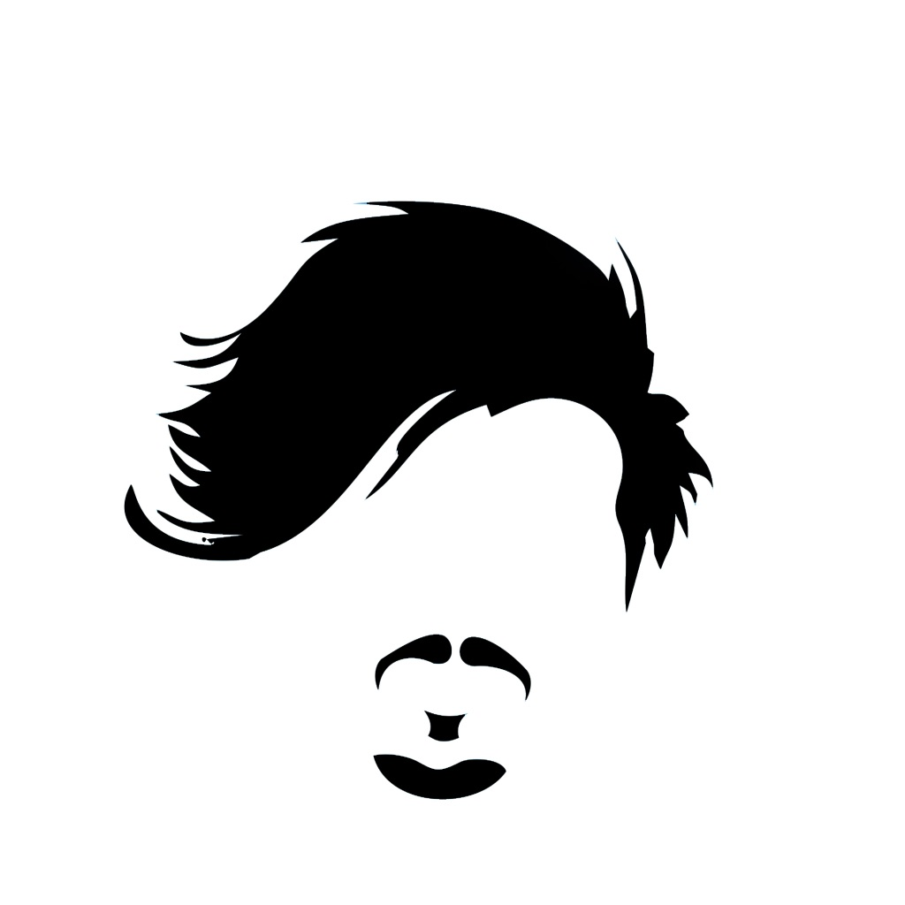

# Parque de diversões 

<!-- Traduzir -->

<!-- Banner -->

  

<!-- Primeiros badges -->

  <!-- Codacy -->
  
  <!-- Último commit -->
  
  <!-- Tamanho do repo -->
  

<!-- Segundos badges -->

  <!-- Contibuidores -->
  
  <!-- Linguagens -->
  
  <!-- Licença de Software -->
  

## Repositórios
* [Log](https://github.com/deppbrazil/log)

## Licença
*   [MIT](./LICENSE) &copy; Mir Carvalho