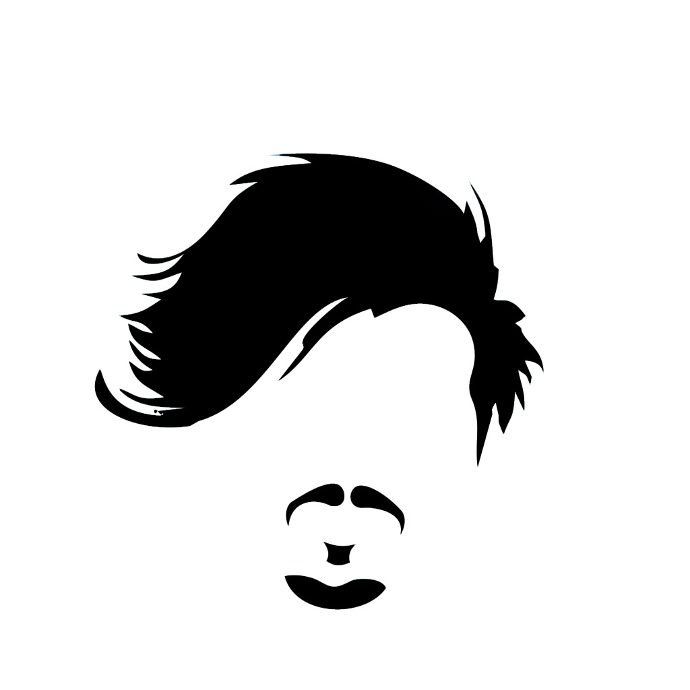

# Playground  

<!-- Translate -->

<!-- Banner -->

  

<!-- First badges -->

  <!-- Codacy -->
  
  <!-- Last commit -->
  
  <!-- Repo size -->
  

<!-- Seconds badges -->

  <!-- Contributors -->
  
  <!-- Language count -->
  
  <!-- Software License -->
  

## Repositories

-   [Log](https://github.com/deppbrazil/log)

## License

-   [MIT](./LICENSE) © Mir Carvalho
